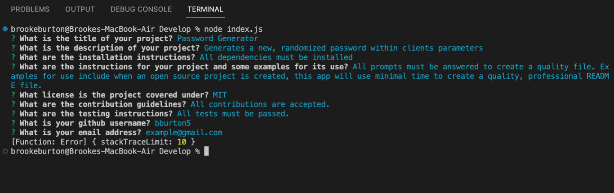
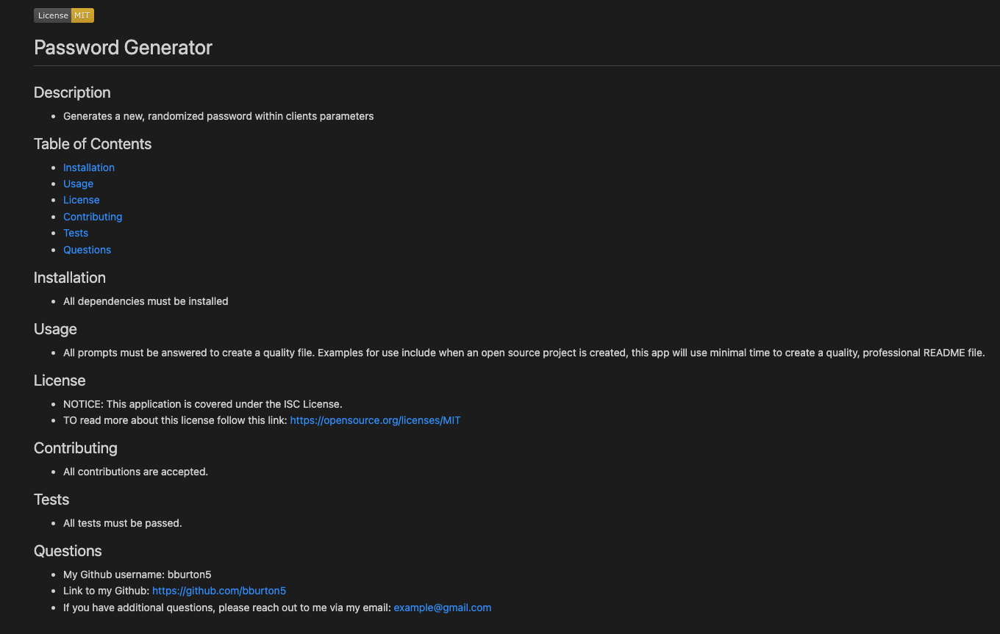

# README-Generator

## This application was created in order to make it easier for clients to create a README file without having to think about what sections should be included. By working on this project, I have learned how to utilize backend processes such as Node.js, inquirer and fs.

## Links

- https://drive.google.com/file/d/1Y9nY_6TLHcSPc5y0dYe10cEb6dimlbL2/view
- https://github.com/bburton5/README-Generator

## Usage

This generator can be used to create quality, professional README files in a short amount of time which allows clients to be more efficient in regards to how they spend their time.

## Credits

- StackOverflow
- MDN
- w3schools
- npmjs
